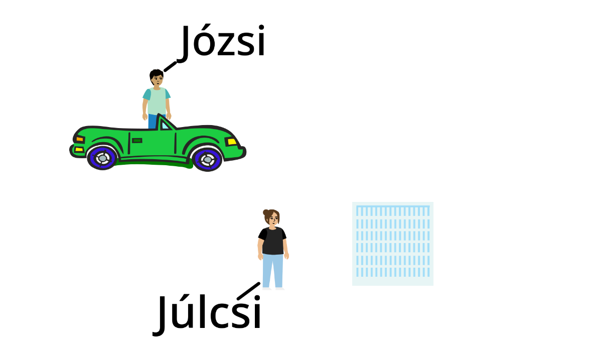
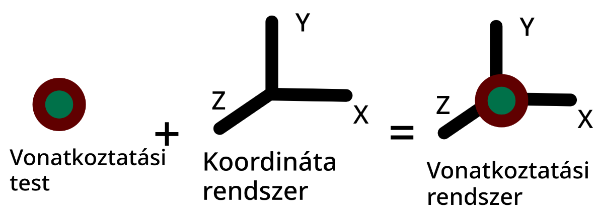
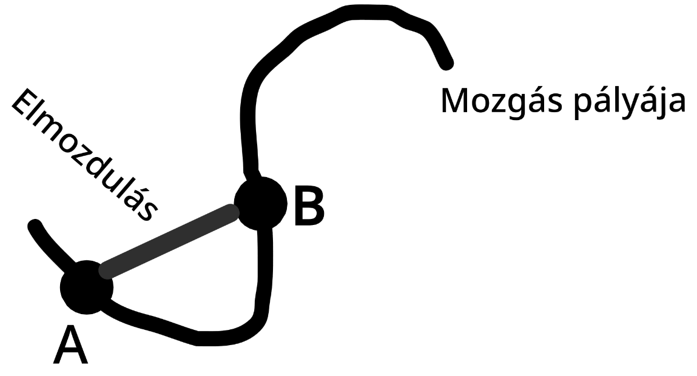
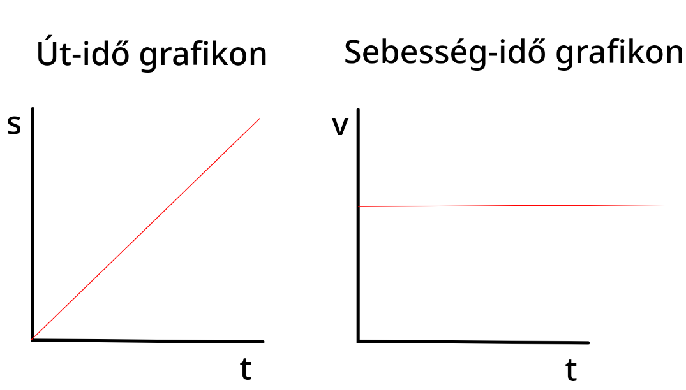

# Kinematika - mozgástan

Pontszerű test mozgásának kinetikai leírása során, olyan mozgásegyenletet írunk fel, amelyből bármely pillanatban ki tudjuk számolni a test által megtett utat, a test sebességét, gyorsulását.

## Mechanikai mozgás

Mechanikai mozgás során, a testek a helyüket vagy a helyzetüket változtatják meg más testekhez képest.

Egy test helyét, mozgás állapotát mindig valamely más testhez viszonyítva tudjuk megadni.
Pl.: az autót a kilométer kőhőz vagy az előtte haladó autóhoz.

Egy test helye, tehát viszonylagos, hiszen egy másik test kell annak meghatározásához.

**Vonatkoztatási test**: az a test, amelyhez képest a többi test helyét viszonyitjuk.

**Vonatkoztatási rendszer**: a vonatkoztatási testhez rögzített koordináta-rendszer.

A nyugalom mindig viszonylagos. A nyugalomban lévő test mozgás állapota megegyezik a választott vonatkoztatási rendszer mozgás állapotával.

---

A testeket leegyszerűsítve kiterjedés nélküli pontszerű testeknek képzeljük el.

A mozgás pályája az a vonal, amelyet a test mozgás során befuthat.

**Megtett út**: az a pálya mentén mért távolság, amelyet a test adott idő alatt ténylegesen le fut. Jele: $s$; mértékegysége: $m$ (méter).

**Elmozdulás**: a mozgás kezdő pontját és végpontját összekötő szakasz.

## Egyenes vonalú egyenletes mozgás

<iframe style="position: absolute; top: 0px; left: 0px; width: 100%; height: 100%;" width="100%" height="100%" src="https://www.youtube-nocookie.com/embed/XCexEmFRqx0" frameborder="0" allow="accelerometer; autoplay; encrypted-media; gyroscope; picture-in-picture; fullscreen"></iframe>

### Kísérlet

A buborék egyenlő idő alatt, egyenlő utat tesz meg.
2-3x hosszabb idő alatt a buborék által megtett út is 2-3x-el nagyobb. A buborék által megtett út és az út megtételéhez szükséges idő között **egyenes arányosság** van.

Ha két mennyiség egymással egyenesen arányos akkor a 2 hányadosa egy állandót határozz meg.

**A megtett út jele**: $\Delta s$

**A megtételhez szükséges idő**: $\Delta t$

**Az egyenes arányosság jelölése**: $\Delta s \sim \Delta t$ => vagyis hányadosa **állandó**.

$$
\frac{\Delta s}{\Delta t} = \text{Állandó/konstans}
$$

Az egyenes vonalú egyenletes mozgásnak nevezzük a mozgást akkor, ha a mozgás pályája egyenes vonal és a megtett út egyenesen arányos az út megtételéhez szükséges idővel.

Az út és az idő hányadosa által meghatározott fizikai mennyiségét sebességnek nevezzük.

$$
\frac{\Delta s}{\Delta t} = v
$$

Az egyenes vonalú egyenletes mozgásnál az út egyenesen arányos az eltelt idővel, az arányossági tényező a mozgás állandó mennyisége, a sebesség.

---

---

A mozgás állandó mennyisége a sebesség. Ezért sebesség-idő grafikonja vízszintes időtengelyel párhuzamos egyenes.

Egyenes vonalú egyenletes mozgásnak az út-idő grafikon az origóból kiinduló félegyenes.

A sebesség-idő grafikon alatti terület nagysága a megtett út nagyságával egyezik meg.

$$
1\frac{m}{s} = 3,6\frac{km}{h}
$$

$$
1h=60min=3600sec
$$

$$
1km=1000m
$$

$$
1\frac{m}{s}=\frac{\frac{1}{1000}km}{\frac{1}{3600}h}=\frac{1}{1000}km * \frac{1}{3600}h = 3,6\frac{km}{h}
$$

$$
\frac{m}{s} \xrightarrow[*3.6]{\text{}} \frac{m}{s}
$$

$$
\frac{m}{s} \xleftarrow[/3.6]{\text{}} \frac{m}{s}
$$

## Változó mozgások, átlag sebesség, pillanatnyi sebesség
